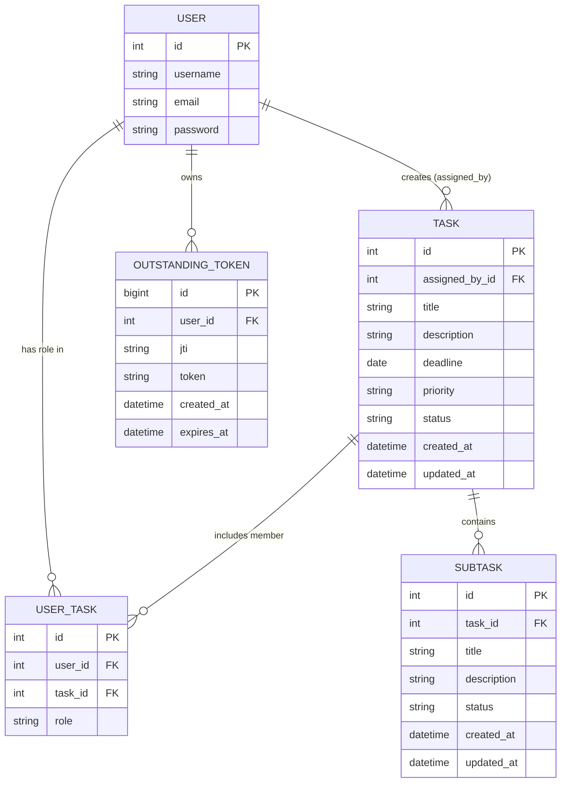

# TaskTracker

TaskTracker is a full-stack web application for task management with role-based access control. It uses Django (backend), React (frontend), and a relational database.

## Features
- Create and manage tasks with title, description, deadline, and priority
- Assign roles per task (Owner, Assigned, Viewer)
- Track status (To do, In progress, Done)
- Subtasks
- API-based communication between backend and frontend
- JWT authentication

## Tech stack
Backend:
- Django
- Django REST Framework
- drf-spectacular (OpenAPI)
- Celery + RabbitMQ (async example)

Frontend:
- React + Vite

Database:
- SQLite for local development (default)
- PostgreSQL supported by updating DATABASES in backend/settings.py

## Docker (recommended)
Run everything with Docker Compose (backend, frontend, PostgreSQL, RabbitMQ):
```
docker compose up --build
```

Backend URL:
http://127.0.0.1:8000/

Frontend URL:
http://localhost:5173/

Optional seed data:
```
docker compose exec backend python manage.py loaddata api_app/fixtures/seed.json
```

RabbitMQ management UI:
http://localhost:15672/ (guest/guest)

## Local setup

### Backend
1. Create and activate a virtual environment:
```
python -m venv .venv
# Windows PowerShell
.\.venv\Scripts\Activate.ps1
# macOS / Linux
source .venv/bin/activate
```

2. Install dependencies and run migrations:
```
pip install -r requirements.txt
python manage.py migrate
```

3. Optional seed data (30+ records):
```
python manage.py loaddata api_app/fixtures/seed.json
```

4. Run the backend:
```
python manage.py runserver
```

Backend URL:
http://127.0.0.1:8000/

### Frontend
```
cd frontend
npm install
npm run dev
```

Frontend URL:
http://localhost:5173/

### Celery and RabbitMQ (optional)
Start RabbitMQ with Docker:
```
docker run -d --hostname tasktracker-rabbit --name tasktracker-rabbit -p 5672:5672 -p 15672:15672 rabbitmq:3-management
```

Start the Celery worker:
```
python -m celery -A backend worker -l info
```

On Windows, you may need:
```
python -m celery -A backend worker -l info --pool=solo
```

### API docs
- Swagger UI: http://127.0.0.1:8000/api/docs/
- OpenAPI schema: http://127.0.0.1:8000/api/schema/
- Redoc: http://127.0.0.1:8000/api/redoc/

### API smoke test
```
curl -i http://127.0.0.1:8000/api/profile/
```
Expected response: 401 Unauthorized (no token)

### Authentication (JWT)
Registration:
```
curl -X POST http://127.0.0.1:8000/api/register/ \
  -H "Content-Type: application/json" \
  -d '{"username":"<username>","email":"<email>","password":"<password>"}'
```

Login:
```
curl -X POST http://127.0.0.1:8000/api/login/ \
  -H "Content-Type: application/json" \
  -d '{"username":"<username>","password":"<password>"}'
```

Authenticated profile request:
```
curl http://127.0.0.1:8000/api/profile/ \
  -H "Authorization: Bearer <ACCESS_TOKEN>"
```

Token refresh:
```
curl -X POST http://127.0.0.1:8000/api/token/refresh/ \
  -H "Content-Type: application/json" \
  -d '{"refresh":"<REFRESH_TOKEN>"}'
```

### Seed data note
Seed users have hashed passwords. If you need credentials, create your own user:
```
python manage.py createsuperuser
```

## Technology rationale
- Django + DRF: fast implementation of secure REST API with clear authentication/permissions model and good testability.
- React + Vite: fast local development and simple component-based UI for iterative frontend work.
- PostgreSQL: reliable relational model for tasks/subtasks/memberships and predictable SQL behavior.
- Celery + RabbitMQ: explicit async processing for background work (example notification job after task creation).
- Docker Compose: reproducible local stack across machines (backend, frontend, database, broker, worker).

## Architecture (layers)
Backend is organized into:
- API layer (`api_app/views.py`): request/response handling and endpoint orchestration.
- Service layer (`api_app/services/`): business logic for auth, tasks, subtasks, and memberships.
- Data layer (`api_app/models.py`): domain entities and persistence.

This separation keeps views thin, reduces duplicated logic, and makes behavior easier to test and extend.
## Data Model (3NF) and Seed Data

The database model is normalized to **3NF**:
- Core entities are separated into dedicated tables (`auth_user`, `Task`, `Subtask`, `UserTask`).
- Many-to-many user-task assignment is modeled through `UserTask` with role attributes.
- Non-key attributes depend on the key, the whole key, and nothing but the key.
- Redundant data is minimized by using foreign keys and role/status/priority values.

Seed data is provided in `api_app/fixtures/seed.json`.

Validation run (after `python manage.py loaddata seed`) confirmed:
- `users = 11`
- `tasks = 13`
- `subtasks = 24`
- `memberships = 13`
- `total = 61` records (minimum requirement: 30)

## ERD (Database Architecture)



## Application Architecture

### Backend (Django + DRF)

- `api_app/urls.py` exposes REST endpoints and maps them to views.
- `api_app/views.py` handles HTTP concerns (request validation, permissions, response status codes).
- `api_app/services/` contains business logic split by domain (`auth_service.py`, `task_service.py`, `subtask_service.py`, `membership_service.py`).
- `api_app/serializers.py` defines API input/output schemas and validation.
- `api_app/models.py` stores persistence model and relations (tasks, subtasks, memberships).
- `api_app/tasks.py` + `backend/celery.py` provide async queue processing (RabbitMQ + Celery).

### Frontend (React + Vite)

- `frontend/src/api.js` centralizes API communication and token refresh flow.
- UI is split into focused components for auth, tasks, details, subtasks, and memberships.
- Frontend consumes backend REST API and handles loading/error states.
